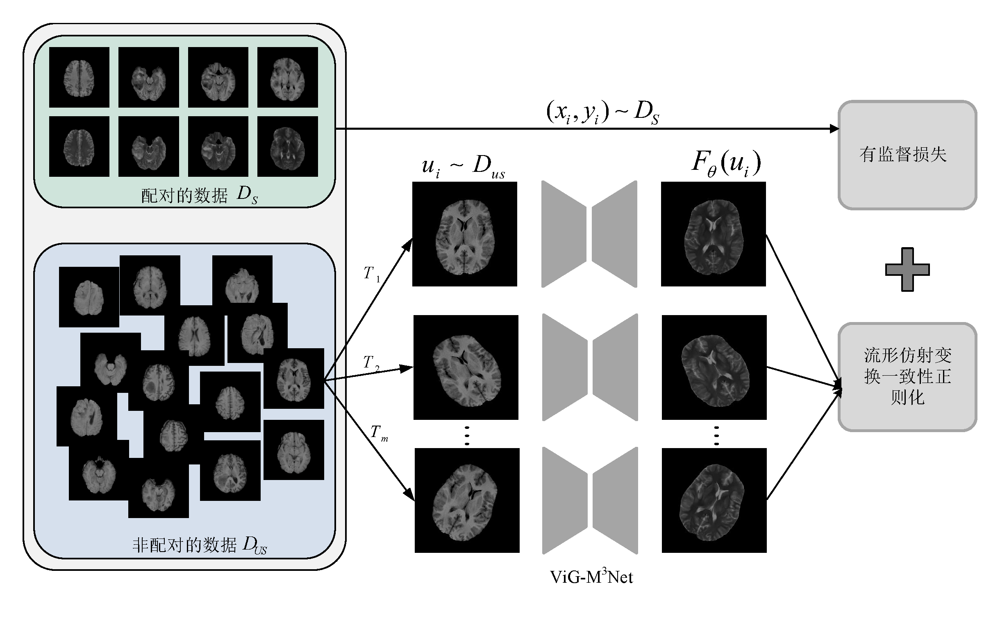

# ViG-M3Net
《流形约束的半监督医学图像合成算法》的 Pytorch 实现。



## 运行环境

1. Linux(ubuntu)
2. python=3.7.3
3. torch=1.7.1+cu92
4. tqdm=4.32.1
5. opencv-python=4.5.3.56
6. pyyaml=5.1.1
7. tensorboard=2.2.1
8. kornia=0.3.2

---

## 运行示例

### 项目结构

```bash
checkpoints	// 预训练的模型
data // 数据集
gcn_lib // vig 相关依赖
Model // 模型的网络结构
results // 存放运行结果
trainer // test
	--log // 存放 tensorboard 的日志文件
Yaml // 模型运行的配置文件
test.py
```

### 测试demo

1. 从[GoogleDrive](https://drive.google.com/file/d/1Ae8mor1Ptci8Ho4SW80B-nD7Iwr1rpuS/view?usp=share_link)下载预训练的 ViG-M$^3$Net ，放到 `checkpoints` 文件夹下；
2. 从[GoogleDrive](https://drive.google.com/drive/folders/1C6XNJSUw_1kR8fwYot47WlJTb08pFRu0?usp=share_link)下载测试数据，放到 `data` 文件夹下；
3. 以 IXI 数据集为例，更改 `Yaml/ViG-M3Net.yaml` 的配置：

```bash
run_name: 'ViG-M3Net/IXI/batch-16/vig2-tcr'
dataset: IXI
val_dataroot: 'datasets/IXI/val'
input_nc: 3
```

```bash
python test.py
```

---

## 致谢

ViG-M$^3$Net 的代码实现参考了 [MMNet](https://github.com/ElegantLee/MMNet)、[Vision GNN](https://github.com/huawei-noah/Efficient-AI-Backbones) 和 [Transformation Consistency Regularization](https://github.com/aamir-mustafa/Transformation-CR)。
